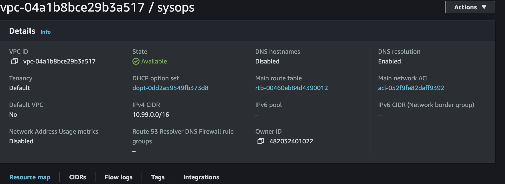
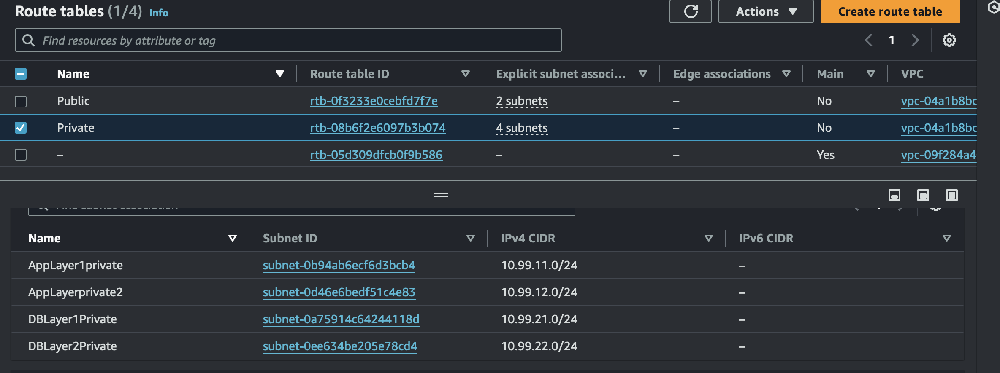
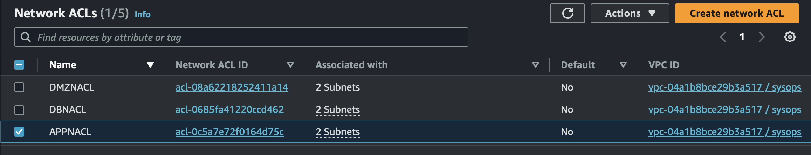

## Part 1: Networking and Security
  ### Steps to create VPC in three tier
> The architecture includes an Amazon Virtual Private Cloud (VPC), Load Balancer (LB), Auto Scaling Group, and a Relational Database(RDS).
> Below is the VPC architecture. Steps to create VPC are mentioned below:
> 

> 1. Create a VPC
> 

> 2. Create Six Subnets
> 

> 3. Create Internet Gateway
> 
> 4. Create Route table 
> 

> 5. Create a NAT Gateway
> 
>
> 6. Create Three NACLs and Associate Them with Subnets
> 

## Part 2: Database Deployment
### An RDS (Relational Database Service) instance to store and manage the application's data.
> Create Subnet DB group and Multi AZ DB
> 
> 
> 

## Part 3: App Tier Instance
### A group of EC2 instances running the application logic that processes user requests.
> 1. Create Instance - update the correct IAM role, Network and subnets. Connect to private app tier that we had created earlier.Update the security group.
> 2. Connect to Instance
> 3. Configure DB schema thorugh CLI
> 4. Perform Health check of App tier and DB connectivity.

## Internal Load Balancing and Auto Scaling
> 1. Create AMI image
> 
> 2. Create Target Group
> 3. Create ALB followed by the Launch template - Use the AMI that was created before.
> 4. Set the security group app tier, and then under Advanced details use the same IAM instance profile we have been using for our EC2 instances.
> 

## Part 4 : Web Tier Instance
### A group of EC2 instances running web servers to handle incoming user requests
> 1. Create Tier 1 (WebTier) which will be used as Front End application.
> 2. update nginx config file, upload code.
> 3. Configure External LB and Autoscaling.

## Conclusions
> Congratulations! You have successfully deployed a three-tier architecture on AWS 
